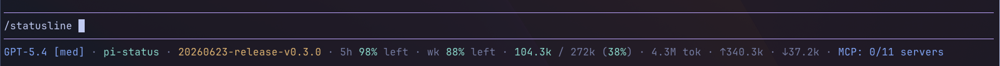
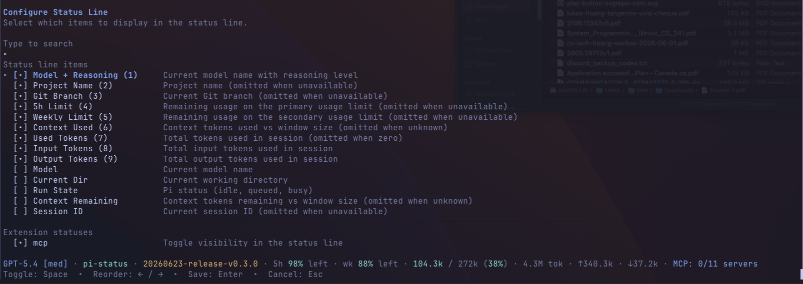

# @pi-vault/pi-status

[](https://www.npmjs.com/package/@pi-vault/pi-status)
[](https://github.com/pi-vault/pi-status/actions/workflows/quality.yml)
[](https://nodejs.org/)
[](LICENSE)

Replace Pi's default footer with a compact status line that shows the session details you actually care about. The extension installs a live footer and adds `/statusline`, an interactive editor for choosing, ordering, and previewing footer segments.

Default footer:

```text
model-with-reasoning · current-dir
```

## Screenshots

Default status line rendering:



Interactive configuration editor (`/statusline`):



## Install And Reload

Install the extension:

```bash
pi install npm:@pi-vault/pi-status
```

Optional: install `pi-usage` if you want the `five-hour-limit` and `weekly-limit` footer segments:

```bash
pi install npm:@pi-vault/pi-usage
```

Reload Pi after installing or upgrading:

```bash
/reload
```

## Use `/statusline`

Once installed, the footer updates automatically. Run `/statusline` inside Pi to open the interactive editor.

The editor lets you:

- turn footer items on or off
- reorder enabled items with `Left` and `Right`
- search the segment list
- preview the result before saving
- control which extension status messages are shown

Changes are saved and reused the next time Pi starts.

During editing, the live footer is temporarily hidden so the inline UI can use the full width cleanly.

## Available Footer Items

You can compose the footer from these segment IDs:

- `model`
- `model-with-reasoning`
- `project-name`
- `current-dir`
- `git-branch`
- `run-state`
- `context-remaining`
- `context-used`
- `used-tokens`
- `total-input-tokens`
- `total-output-tokens`
- `session-id`
- `five-hour-limit`
- `weekly-limit`

`five-hour-limit` and `weekly-limit` depend on standalone [`@pi-vault/pi-usage`](https://www.npmjs.com/package/@pi-vault/pi-usage). When `pi-usage` is not installed or has not responded yet, those segments are hidden from `/statusline` and omitted from the footer.

Extension statuses auto-append to the footer when visible. Use `/statusline` to hide individual status keys or switch to an allowlist.

## Common Examples

Keep it minimal:

```text
model-with-reasoning · current-dir
```

Show more session detail:

```text
model · run-state · git-branch · context-used · context-remaining · session-id
```

Usage-aware footer:

```text
model-with-reasoning · current-dir · five-hour-limit · weekly-limit
```

## Compatibility

- Node.js `>=22.19`
- Pi host environment with `@earendil-works/pi-coding-agent` and `@earendil-works/pi-tui`
- Tested in this repo against `@earendil-works/pi-coding-agent@0.79.3` and `@earendil-works/pi-tui@0.79.3`

## Development

```bash
pnpm install
pnpm check
pnpm run pack:dry-run
```

## License

MIT
